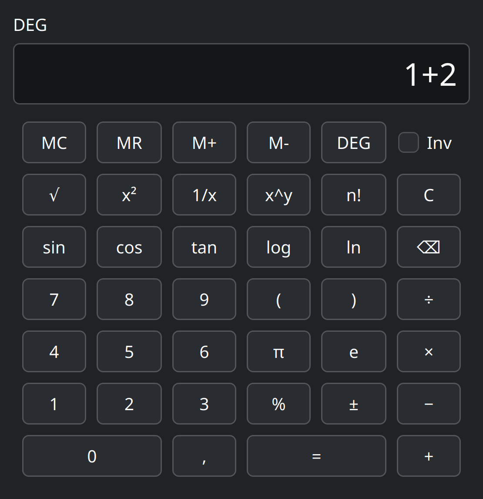

# Calculator

A native scientific calculator for the Linux desktop, built with Qt 6 (Widgets) and C++. It's designed to feel like a classic handheld calculator: addition, subtraction, multiplication, division, parentheses, powers, roots, trigonometry, logarithms, and basic memory (MC/MR/M+/M-), with a clean expression parser underneath (no `eval()` of any kind).



## Features

- Standard operations: `+ − × ÷`, parentheses, decimal point (follows your system's `.`/`,` convention, and accepts either while typing), sign toggle, percent, clear, backspace
- Scientific functions: `√`, `x²`, `1/x`, `x^y`, `n!`, `sin/cos/tan` with an "Inv" toggle for `asin/acos/atan`, `log10`, `ln`, `π`, `e`
- DEG/RAD angle mode toggle
- Memory: `MC`, `MR`, `M+`, `M-`
- Correct operator precedence and parentheses handling via a real recursive-descent parser
- Graceful error messages (division by zero, invalid expressions, domain errors like `sqrt(-1)`, factorial of a negative/non-integer number, overflow, etc.) — invalid input never crashes the app
- Full keyboard support alongside mouse/touch use

## How it's organized

The calculator logic (`engine/`) is a plain C++ library with **no dependency on Qt at all**, so it can be built and tested completely on its own. The GUI (`app/`) is a thin layer on top of it.

```
engine/   the calculator itself: parser, math functions, memory (no GUI code, no Qt)
app/      the Qt Widgets window that calls into engine/
tests/    automated tests for engine/, using Qt Test
```

## Building it (step by step, from nothing installed)

You don't need any prior experience with C++, Qt, or CMake to do this — just follow the steps for your distro.

### 1. Install the tools you need

You need three things: a C++ compiler, CMake, and Qt 6 (with its Widgets and Test modules).

**Arch Linux / CachyOS / Manjaro / EndeavourOS:**
```bash
sudo pacman -S base-devel cmake qt6-base qt6-tools
```

**Ubuntu / Debian (22.04+ / 12+):**
```bash
sudo apt update
sudo apt install build-essential cmake qt6-base-dev
```

**Fedora:**
```bash
sudo dnf install gcc-c++ cmake qt6-qtbase-devel
```

**openSUSE:**
```bash
sudo zypper install gcc-c++ cmake qt6-base-devel
```

If a package name above doesn't exist on your exact distro version, search your package manager for "qt6-base" (or "qt6-base-dev") — that's the one that matters.

### 2. Get the source code

If you don't already have the `Qtnative-Cplusplus-calculator` folder, copy/clone it onto your machine, then open a terminal in it:

```bash
cd Qtnative-Cplusplus-calculator
```

### 3. Configure and build

These three commands are all it takes. Run them in order, from inside the project folder:

```bash
cmake -B build
cmake --build build -j"$(nproc)"
```

- `cmake -B build` reads the project and creates a `build/` folder with everything set up (you only need to re-run this if you add/remove files or change the `CMakeLists.txt` files).
- `cmake --build build` actually compiles everything. `-j"$(nproc)"` just tells it to use all your CPU cores so it's faster — it's safe to leave off if you want.

If this finishes without errors, you now have a working calculator.

### 4. Run the automated tests (optional, but recommended)

The calculator engine has an automated test suite. To run it:

```bash
cd build
ctest --output-on-failure
```

You should see `100% tests passed`.

### 5. Run the calculator

From the `build` folder:

```bash
./app/calculator
```

A calculator window should appear. That's it.

## Rebuilding after making changes

If you (or someone helping you) edits the source code later, you don't need to redo everything — just run this again from the project folder:

```bash
cmake --build build -j"$(nproc)"
```

## Installing it so it shows up in your app launcher (optional)

By default the calculator only exists as `build/app/calculator` — running it means typing that path in a terminal every time, and it's not "installed" anywhere your desktop knows about. If you'd like to launch it like any other app (from KDE's Kickoff menu, by searching "Calculator", with its own icon), do this instead. It only touches files inside your own home folder — no `sudo`, and easy to undo later (just delete the files these steps create).

### 1. Copy the built program somewhere permanent

`build/` is a working folder that can be deleted and regenerated at any time, so nothing should point at it long-term. Install a real copy into `~/.local/bin` (a standard per-user location for your own programs):

```bash
cmake --install build --prefix "$HOME/.local"
```

This copies the calculator to `~/.local/bin/calculator`. (This only works after you've already built the project once, per the steps above.)

### 2. Install the icon

The calculator's icon images already live in the project at `app/resources/icons/`. Copy them into your personal icon theme folder, in each size KDE expects:

```bash
for size in 16 32 48 64 128 256; do
  mkdir -p ~/.local/share/icons/hicolor/${size}x${size}/apps
  cp "app/resources/icons/calculator-${size}.png" \
     ~/.local/share/icons/hicolor/${size}x${size}/apps/calculator.png
done
```
(Run this from inside the project folder, so the `app/resources/...` path is found.)

### 3. Create the launcher entry

KDE (and every other Linux desktop) discovers apps for its menu by reading small text files called `.desktop` files from `~/.local/share/applications/`. Create one:

```bash
mkdir -p ~/.local/share/applications
cat > ~/.local/share/applications/calculator.desktop << 'EOF'
[Desktop Entry]
Type=Application
Name=Calculator
Comment=Scientific calculator
Exec=/home/YOUR_USERNAME/.local/bin/calculator
Icon=calculator
Terminal=false
Categories=Utility;Calculator;
EOF
```

Replace `YOUR_USERNAME` with your actual username (or the full result of running `echo ~/.local/bin/calculator`).

### 4. Refresh KDE so it notices right away

This step is optional — KDE usually picks up new entries within a minute or two on its own — but this makes it show up immediately:

```bash
kbuildsycoca6 --noincremental
```

Calculator should now appear in Kickoff if you search for it.

### Updating the installed copy later

If you change the source code and rebuild, the copy in `~/.local/bin` does **not** update by itself — it's a separate file from `build/app/calculator`. Re-install it with:

```bash
cmake --build build -j"$(nproc)"
cmake --install build --prefix "$HOME/.local"
```

## Which systems will this run on?

**Building from source** (the instructions above) works on essentially any Linux distribution — any CPU architecture — as long as it has a C++20 compiler, CMake 3.21+, and Qt 6 with the Widgets and Test modules installed. This is the reliable way to get it running on a machine other than the one it was originally built on.

**A pre-built `calculator` binary is more limited.** It's linked against the exact versions of glibc and Qt6 present on the machine that built it. Because glibc binaries only run on systems with an *equal-or-newer* glibc than the one they were built against, a binary built on a bleeding-edge rolling-release distro (like Arch/CachyOS) will often fail to run on older-glibc distros (e.g. Ubuntu 22.04/24.04, Debian 12, RHEL). It also only runs on the CPU architecture it was compiled for. If you need a single binary that works across many distros, that requires static linking or packaging (Flatpak/AppImage), which is a separate step from a normal build.

The app itself works under both X11 and Wayland (via XWayland) sessions, and isn't tied to KDE — it runs on any desktop environment with Qt6 installed, though it will pick up your system's native theme (e.g. Breeze on KDE Plasma) automatically.

## Notes on behavior

- Chained signs like `1++++++++++++2` are valid on purpose (each extra `+`/`-` is a unary operator, same as in ordinary math notation), not a parsing bug.
- The decimal-point button, and typed input, follow your system locale (e.g. `,` in Sweden), but the engine understands both `.` and `,` regardless.
- There's no letter/alphabet input from the keyboard by design — like a physical calculator, function names (`sin`, `sqrt`, etc.) only ever come from their dedicated buttons.
